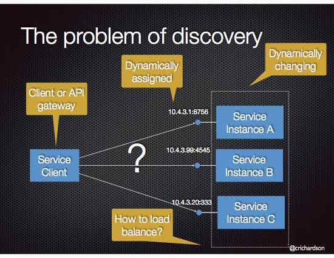

# Pattern: Client-side service discovery

## Context
服务（之间）通常需要互相调用。在单体应用中，服务通过语言级别的方法（Method）或过程（Procedure）访问进行互相调用。在一个传统的分布式系统部署中，服务运行在固定的，众所周知的位置（hosts和ports），因此可以使用HTTP/REST或RPC机制方便的进行互相访问。但是，一个现代的基于微服务的应用通常运行在虚拟化的或容器化的环境中，服务实例的数目和他们的位置是动态变化的。

因此，你必须实现一种机制，能够让客户端请求短暂服务实例的动态变更集合（dynamically changing set of ephemeral service instances）。

## Problem
如何让客户端 - API Gateway或其他服务 - 发现服务实例的位置？

## Forces
* 每个服务实例暴露一个远程API，例如HTTP/REST，或Thrift等，在一个特定的位置（host和port）
* 服务实例的个数和它们的位置动态变更
* 虚拟机和容器经常分配动态IP地址
* 服务实例格式可能动态变化。举例来说，EC2 Autoscaling Group根据负载调整实例个数。

## Solution
